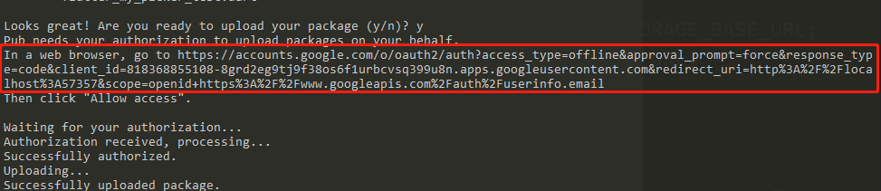

[参考链接](https://www.kikt.top/posts/flutter/package/publish-fail/)

# flutter包发布

## 1. 科学上网

- 没办法的事情，谁让服务器在国外呢？还只能用google邮箱登录

由于命令行无法直接使用代理，所以需要进行设置

### linux类系统
```bash
export http_proxy=http://127.0.0.1:7890
export https_proxy=http://127.0.0.1:7890
```

### window系统
```bat
set http_proxy=http://127.0.0.1:7890
set https_proxy=http://127.0.0.1:7890
```

## 2. 重置环境变量
国内的话，可能之前设置了相关变量，需要进行删除，就像 npm 如果平时使用淘宝镜像， 又需要发布 npm 包的时候，也需要切换源。

### linux类系统
```bash
unset FLUTTER_STORAGE_BASE_URL
unset PUB_HOSTED_URL
```
### window系统

删除 FLUTTER_STORAGE_BASE_URL 和 PUB_HOSTED_URL 的环境变量

## 3. 命令行发布

- 切记不要在 vs code 中的 终端发布
```bash
flutter packages pub publish --server=https://pub.dartlang.org
```

如果项目检测有问题的话，就按照建议进行修改。

如果没问题的话，点击图片中的链接，进行授权认证，通过后应该就可以发布成功了。
 

## 4. 环境变量设置(不然下载依赖包可能会失败或者很慢)

### linux类系统
```bash
export PUB_HOSTED_URL=https://pub.flutter-io.cn
export FLUTTER_STORAGE_BASE_URL=https://storage.flutter-io.cn
```

### window系统
设置上方的两个环境变量

如果看了以后，可以科学上网但是没有发布成功，可以提issue联系我。